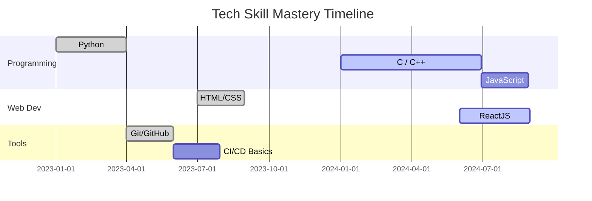

# 👨‍💻 Akshat | Aspiring Finance & Tech Pro

Welcome to my GitHub! I'm a passionate B.Tech student driven to master data structures, full-stack development, finance, and AI/ML.

---

  

---

## 🚀 Summary

💡 Building the future with tech + finance  
📊 Interested in LLMs, stock trading, algorithmic finance  
🎯 Currently learning: DSA | Python | Neural Networks | Web Dev

---

## 🛠️ Tech Stack & Skills

  

### 🔢 Programming & DSA
- 🐍 Python (NumPy, Pandas, Matplotlib)
- 💻 C / C++ for Algorithms & Data Structures
- 📘 Java, JavaScript for backend & frontend logic
- 📀 Currently mastering: Recursion, DP, Trees

### 🌐 Web Development
- 💡 HTML5, CSS3, JavaScript
- ⚛️ ReactJS + TailwindCSS
- 🌐 APIs, DOM, Responsive Design

### ⚙️ Tools & Workflow
- 🔧 Git & GitHub (Branching, PRs, Workflows)
- 🛠️ VSCode, Postman, Figma
- 🧪 CI/CD Basics, GitHub Actions

### 🧠 Soft Skills
- 🎯 Time Management, Problem Solving
- 💬 Communication & Collaboration
- 🚀 Rapid Learning & Adaptability

---

  
📈 🧠 Click to view my Skill Mastery Timeline (Mermaid Chart)

---

## 💼 Experience

| Role | Organization | Duration |
|------|--------------|----------|
| Intern - Finance & Automation | Genpact | May 2025 – Jul 2025 |
| Senior Core - AIML Domain | Team Prometheus | Oct 2024 – May 2025 |
| Core Committee Member - R&D Department | CSED | Mar 2025 – Present |
| Core Committee Member - PR & Outreach Department | CSED | Mar 2025 – Present |
| Core Committee Member - Management Department | TAG | Feb 2025 – Present |

---

## 📂 Projects

- **💰 Personal Finance Tracker**  
  A smart budgeting and expense visualization system.  
  _Python, Pandas, Excel, Matplotlib_

- **🌐 Portfolio Website**  
  My personal website built with React and TailwindCSS.

- **📈 Stock Trading Dashboard** *(In Progress)*  
  Real-time stock tracker and trade simulation using Indian APIs.

- **🧠 LLM-Based Intent Routing in Networking**  
  A research-based AI project using Transformer models.

---

## 📊 Coding Platform Progress

### 🔗 Profiles

#### 🟢 GeeksforGeeks  
  
> _“Solving DSA problems regularly on GFG to sharpen problem-solving skills!”_

#### 🟢 HackerRank  
  
> _“Check out my 5⭐️ badges and 30+ solved challenges on HackerRank.”_

#### 🔵 CodeChef  
  

---

### 📈 Stats & Charts

---

## 🔵 LinkedIn

  
> _“Let’s connect and grow together — follow my journey in tech and finance!”_

---

> ✨ _“Learning never exhausts the mind.”_ — Leonardo da Vinci
